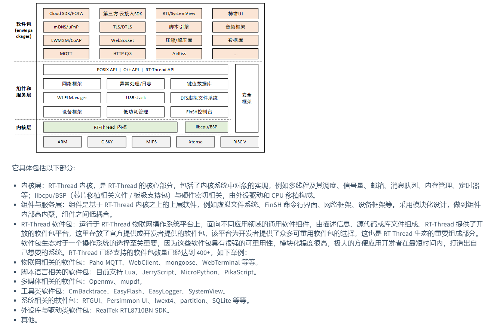
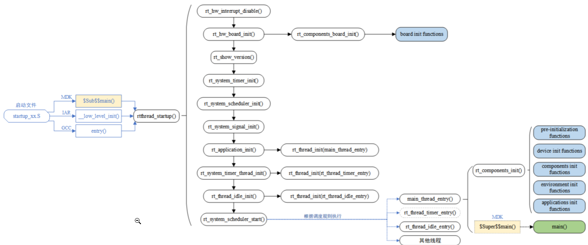
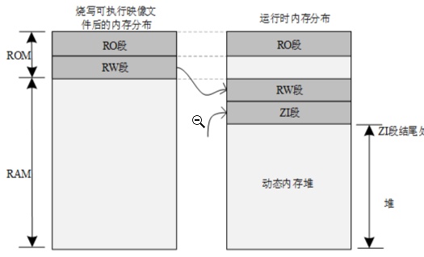
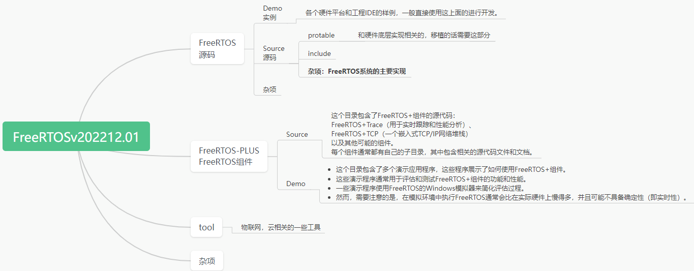

-   多任务编程比单线程复杂,多线程切换就产生了上下文的保存恢复和资源访问,
-   为了保存上下文就必须有线程栈,
-   在线程栈之外又有全局栈,多线程程序访问全局栈就产生了数据一致性问题,为了解决数据一致性问题就有了线程间同步
-   为了避免过度使用全局栈要让线程间共享资源就又有了线程间通信的方式
-   既然可以多线程了那中断就可以实现快如快出了

系统框架图

启动流程图


## RT-Thread内存分布

硬件MCU包括ROM和RAM，ROM就是片内Falsh，RAM相当于运行内存。

程序编译好之后会有

-   code：代码段
-   RO-data 只读段 常亮、静态变量
-   RW-data 读写段 初始化全局变量
-   ZI-data 未初始化全局变量和初始化为0的变量

STM32 在上电启动之后默认从 Flash 启动，启动之后会将 RW 段中的 RW-data（初始化的全局变量）搬运到 RAM 中，但不会搬运 RO 段，即 CPU 的执行代码从 Flash 中读取，另外根据编译器给出的 ZI 地址和大小分配出 ZI 段，并将这块 RAM 区域清零。



内存分布图

## RT-Thread自动初始化机制

自动初始化机制是指初始化函数不需要被显式调用，只需要在函数定义处通过宏定义的方式进行申明，就会在系统启动过程中被执行。

```c
int rt_hw_usart_init(void)  /* 串口初始化函数 */
{
     ... ...
     /* 注册串口 1 设备 */
     rt_hw_serial_register(&serial1, "uart1",
                        RT_DEVICE_FLAG_RDWR | RT_DEVICE_FLAG_INT_RX,
                        uart);
     return 0;
}
INIT_BOARD_EXPORT(rt_hw_usart_init);    /* 使用组件自动初始化机制 */
```

在系统启动流程图中，有两个函数：`rt_components_board_init()` 与 `rt_components_init()`，其后的带底色方框内部的函数表示被自动初始化的函数，其中：

1.  `board init functions`为所有通过 `INIT_BOARD_EXPORT(fn)` 申明的初始化函数。
2.  `pre-initialization functions` 为所有通过 `INIT_PREV_EXPORT(fn)`申明的初始化函数。
3.  `device init functions` 为所有通过 `INIT_DEVICE_EXPORT(fn)` 申明的初始化函数。
4.  `components init functions` 为所有通过 `INIT_COMPONENT_EXPORT(fn)`申明的初始化函数。
5.  `enviroment init functions` 为所有通过 `INIT_ENV_EXPORT(fn)` 申明的初始化函数。
6.  `application init functions` 为所有通过 `INIT_APP_EXPORT(fn)`申明的初始化函数。

用来实现自动初始化功能的宏接口定义详细描述如下表所示：

| **初始化顺序** | **宏接口**                | **描述**                                     |
| -------------- | ------------------------- | -------------------------------------------- |
| 1              | INIT_BOARD_EXPORT(fn)     | 非常早期的初始化，此时调度器还未启动         |
| 2              | INIT_PREV_EXPORT(fn)      | 主要是用于纯软件的初始化、没有太多依赖的函数 |
| 3              | INIT_DEVICE_EXPORT(fn)    | 外设驱动初始化相关，比如网卡设备             |
| 4              | INIT_COMPONENT_EXPORT(fn) | 组件初始化，比如文件系统或者 LWIP            |
| 5              | INIT_ENV_EXPORT(fn)       | 系统环境初始化，比如挂载文件系统             |
| 6              | INIT_APP_EXPORT(fn)       | 应用初始化，比如 GUI 应用                    |

## RT-Thread内核对象模型

分为**静态内核对象**：存放在RW、ZI段，系统初始化；**动态内核对象**：创建在内存堆，手动初始化。

RT-Thread中的内核对象包括：线程，信号量，互斥量，事件，邮箱，消息队列和定时器，内存池，设备驱动等。

```c
/* 线程 1 的对象和运行时用到的栈 */
static struct rt_thread thread1;
static rt_uint8_t thread1_stack[512];

/* 线程 1 入口 */
void thread1_entry(void* parameter)
{
     int i;

    while (1)
    {
        for (i = 0; i < 10; i ++)
        {
            rt_kprintf("%d\n", i);

            /* 延时 100ms */
            rt_thread_mdelay(100);
        }
    }
}

/* 线程 2 入口 */
void thread2_entry(void* parameter)
{
     int count = 0;
     while (1)
     {
         rt_kprintf("Thread2 count:%d\n", ++count);

        /* 延时 50ms */
        rt_thread_mdelay(50);
    }
}

/* 线程例程初始化 */
int thread_sample_init()
{
     rt_thread_t thread2_ptr;
     rt_err_t result;

    /* 初始化线程 1 */
    /* 线程的入口是 thread1_entry，参数是 RT_NULL
     * 线程栈是 thread1_stack
     * 优先级是 200，时间片是 10 个 OS Tick
     */
    result = rt_thread_init(&thread1,
                            "thread1",
                            thread1_entry, RT_NULL,
                            &thread1_stack[0], sizeof(thread1_stack),
                            200, 10);

    /* 启动线程 */
    if (result == RT_EOK) rt_thread_startup(&thread1);

    /* 创建线程 2 */
    /* 线程的入口是 thread2_entry, 参数是 RT_NULL
     * 栈空间是 512，优先级是 250，时间片是 25 个 OS Tick
     */
    thread2_ptr = rt_thread_create("thread2",
                                thread2_entry, RT_NULL,
                                512, 250, 25);

    /* 启动线程 */
    if (thread2_ptr != RT_NULL) rt_thread_startup(thread2_ptr);

    return 0;
}
```


# Free-RTOS：

## 创建任务：xTaskCreate（）

```c
BaseType_t xTaskCreate( TaskFunction_t pxTaskCode,
                       const char * const pcName, 
                       const configSTACK_DEPTH_TYPE usStackDepth,
                       void * const pvParameters,
                       UBaseType_t uxPriority,
                       TaskHandle_t * const pxCreatedTask )
```

### 解释

`xTaskCreate` 是 FreeRTOS 中用于创建新任务的函数。任务（或线程）是实时操作系统中的基本执行单元，它们共享系统的资源，但各自有自己的执行上下文（如栈）。`xTaskCreate` 函数允许你定义任务的各种属性，如任务执行的函数、任务的名称、栈大小、传递给任务的参数、任务的优先级以及一个用于接收任务句柄的指针。

下面是 `xTaskCreate` 函数的参数详解：

1.  **`TaskFunction_t  pxTaskCode`**: 指向任务函数的指针，任务函数是任务启动后要执行的代码。返回类型为 `void` 且不接受任何参数。
2.  **`const char * const  pcName`**: 任务的名称，用于调试和跟踪。名称是一个字符串。
3.  **`const configSTACK_DEPTH_TYPE  usStackDepth`**: 定义任务的栈大小。
4.  **`void * const pvParameters`**: 指向传递给任务函数的参数的指针。允许在创建任务时传递任意数量的数据给任务函数。任务函数通常会接收一个 `void *` 类型的参数，并相应地进行类型转换。
5.  **`UBaseType_t uxPriority`**: 定义任务的优先级
6.  **`TaskHandle_t * const pxCreatedTask`**: 指向任务句柄的指针。如果任务成功创建，句柄将被设置为新任务的标识符，并可以通过这个句柄来管理和控制任务（例如，挂起、恢复或删除任务）。如果任务创建失败，句柄将设置为 `NULL`。

`xTaskCreate` 函数的返回值是一个状态码，用于指示任务是否成功创建。如果返回值是 `pdPASS`，则表示任务创建成功；如果返回值是 `errCOULD_NOT_ALLOCATE_REQUIRED_MEMORY`，则表示系统没有足够的内存来创建任务。

### 例程

```c
//任务
void MyFunPrintf( void * p)
{
	//TODO
}

int main( void )
{
	prvSetupHardware();
    
	//---------------user APP----------------
    
    TaskHandle_t MyFunPrintfid; 
    xTaskCreate(MyFunPrintf,"MyFunPrintf",100,null,1,&MyFunPrintfid);
    //---------------------------------
    
    vTaskStartScheduler();
    return 0;
}
```

## Free-rtos源码

### 目录结构




### 编程规范


