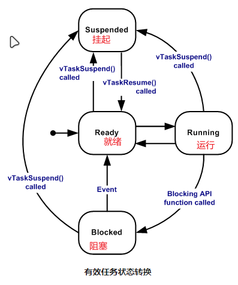

-   多任务编程比单线程复杂,多线程切换就产生了上下文的保存恢复和资源访问,
-   为了保存上下文就必须有线程栈,
-   在线程栈之外又有全局栈,多线程程序访问全局栈就产生了数据一致性问题,为了解决数据一致性问题就有了线程间同步
-   为了避免过度使用全局栈要让线程间共享资源就又有了线程间通信的方式
-   既然可以多线程了那中断就可以实现快如快出了

系统框架图

启动流程图


# RT_Thread

## RT-Thread内存分布

硬件MCU包括ROM和RAM，ROM就是片内Flash，RAM相当于运行内存。

程序编译好之后会有

-   code：代码段
-   RO-data 只读段 常亮、静态变量
-   RW-data 读写段 初始化全局变量
-   ZI-data 未初始化全局变量和初始化为0的变量

STM32 在上电启动之后默认从 Flash 启动，启动之后会将 RW 段中的 RW-data（初始化的全局变量）搬运到 RAM 中，但不会搬运 RO 段，即 CPU 的执行代码从 Flash 中读取，另外根据编译器给出的 ZI 地址和大小分配出 ZI 段，并将这块 RAM 区域清零。


内存分布图

## RT-Thread自动初始化机制

自动初始化机制是指初始化函数不需要被显式调用，只需要在函数定义处通过宏定义的方式进行申明，就会在系统启动过程中被执行。

```c
int rt_hw_usart_init(void)  /* 串口初始化函数 */
{
     ... ...
     /* 注册串口 1 设备 */
     rt_hw_serial_register(&serial1, "uart1",
                        RT_DEVICE_FLAG_RDWR | RT_DEVICE_FLAG_INT_RX,
                        uart);
     return 0;
}
INIT_BOARD_EXPORT(rt_hw_usart_init);    /* 使用组件自动初始化机制 */
```

在系统启动流程图中，有两个函数：`rt_components_board_init()` 与 `rt_components_init()`，其后的带底色方框内部的函数表示被自动初始化的函数，其中：

1.  `board init functions`为所有通过 `INIT_BOARD_EXPORT(fn)` 申明的初始化函数。
2.  `pre-initialization functions` 为所有通过 `INIT_PREV_EXPORT(fn)`申明的初始化函数。
3.  `device init functions` 为所有通过 `INIT_DEVICE_EXPORT(fn)` 申明的初始化函数。
4.  `components init functions` 为所有通过 `INIT_COMPONENT_EXPORT(fn)`申明的初始化函数。
5.  `enviroment init functions` 为所有通过 `INIT_ENV_EXPORT(fn)` 申明的初始化函数。
6.  `application init functions` 为所有通过 `INIT_APP_EXPORT(fn)`申明的初始化函数。

用来实现自动初始化功能的宏接口定义详细描述如下表所示：

| **初始化顺序** | **宏接口**                | **描述**                                     |
| -------------- | ------------------------- | -------------------------------------------- |
| 1              | INIT_BOARD_EXPORT(fn)     | 非常早期的初始化，此时调度器还未启动         |
| 2              | INIT_PREV_EXPORT(fn)      | 主要是用于纯软件的初始化、没有太多依赖的函数 |
| 3              | INIT_DEVICE_EXPORT(fn)    | 外设驱动初始化相关，比如网卡设备             |
| 4              | INIT_COMPONENT_EXPORT(fn) | 组件初始化，比如文件系统或者 LWIP            |
| 5              | INIT_ENV_EXPORT(fn)       | 系统环境初始化，比如挂载文件系统             |
| 6              | INIT_APP_EXPORT(fn)       | 应用初始化，比如 GUI 应用                    |

## RT-Thread内核对象模型

分为**静态内核对象**：存放在RW、ZI段，系统初始化；**动态内核对象**：创建在内存堆，手动初始化。

RT-Thread中的内核对象包括：线程，信号量，互斥量，事件，邮箱，消息队列和定时器，内存池，设备驱动等。

```c
/* 线程 1 的对象和运行时用到的栈 */
static struct rt_thread thread1;
static rt_uint8_t thread1_stack[512];

/* 线程 1 入口 */
void thread1_entry(void* parameter)
{
     int i;

    while (1)
    {
        for (i = 0; i < 10; i ++)
        {
            rt_kprintf("%d\n", i);

            /* 延时 100ms */
            rt_thread_mdelay(100);
        }
    }
}

/* 线程 2 入口 */
void thread2_entry(void* parameter)
{
     int count = 0;
     while (1)
     {
         rt_kprintf("Thread2 count:%d\n", ++count);

        /* 延时 50ms */
        rt_thread_mdelay(50);
    }
}

/* 线程例程初始化 */
int thread_sample_init()
{
     rt_thread_t thread2_ptr;
     rt_err_t result;

    /* 初始化线程 1 */
    /* 线程的入口是 thread1_entry，参数是 RT_NULL
     * 线程栈是 thread1_stack
     * 优先级是 200，时间片是 10 个 OS Tick
     */
    result = rt_thread_init(&thread1,
                            "thread1",
                            thread1_entry, RT_NULL,
                            &thread1_stack[0], sizeof(thread1_stack),
                            200, 10);

    /* 启动线程 */
    if (result == RT_EOK) rt_thread_startup(&thread1);

    /* 创建线程 2 */
    /* 线程的入口是 thread2_entry, 参数是 RT_NULL
     * 栈空间是 512，优先级是 250，时间片是 25 个 OS Tick
     */
    thread2_ptr = rt_thread_create("thread2",
                                thread2_entry, RT_NULL,
                                512, 250, 25);

    /* 启动线程 */
    if (thread2_ptr != RT_NULL) rt_thread_startup(thread2_ptr);

    return 0;
}
```


# Free-RTOS：

## 创建任务：xTaskCreate（）

```c
BaseType_t xTaskCreate( TaskFunction_t pxTaskCode,
                       const char * const pcName, 
                       const configSTACK_DEPTH_TYPE usStackDepth,
                       void * const pvParameters,
                       UBaseType_t uxPriority,
                       TaskHandle_t * const pxCreatedTask )
```

### 解释

`xTaskCreate` 是 FreeRTOS 中用于创建新任务的函数。任务（或线程）是实时操作系统中的基本执行单元，它们共享系统的资源，但各自有自己的执行上下文（如栈）。`xTaskCreate` 函数允许你定义任务的各种属性，如任务执行的函数、任务的名称、栈大小、传递给任务的参数、任务的优先级以及一个用于接收任务句柄的指针。

下面是 `xTaskCreate` 函数的参数详解：

1.  **`TaskFunction_t  pxTaskCode`**: 指向任务函数的指针，任务函数是任务启动后要执行的代码。返回类型为 `void` 且不接受任何参数。
2.  **`const char * const  pcName`**: 任务的名称，用于调试和跟踪。名称是一个字符串。
3.  **`const configSTACK_DEPTH_TYPE  usStackDepth`**: 定义任务的栈大小。
4.  **`void * const pvParameters`**: 指向传递给任务函数的参数的指针。允许在创建任务时传递任意数量的数据给任务函数。任务函数通常会接收一个 `void *` 类型的参数，并相应地进行类型转换。
5.  **`UBaseType_t uxPriority`**: 定义任务的优先级
6.  **`TaskHandle_t * const pxCreatedTask`**: 指向任务句柄的指针。如果任务成功创建，句柄将被设置为新任务的标识符，并可以通过这个句柄来管理和控制任务（例如，挂起、恢复或删除任务）。如果任务创建失败，句柄将设置为 `NULL`。

`xTaskCreate` 函数的返回值是一个状态码，用于指示任务是否成功创建。如果返回值是 `pdPASS`，则表示任务创建成功；如果返回值是 `errCOULD_NOT_ALLOCATE_REQUIRED_MEMORY`，则表示系统没有足够的内存来创建任务。

### 例程

```c
//任务
void MyFunPrintf( void * p)
{
	//TODO
}

int main( void )
{
	prvSetupHardware();
    
	//---------------user APP----------------
    
    TaskHandle_t MyFunPrintfid; 
    xTaskCreate(MyFunPrintf,"MyFunPrintf",100,null,1,&MyFunPrintfid);
    //---------------------------------
    
    vTaskStartScheduler();
    return 0;
}
```

## Free-rtos源码

### 目录结构


### 命名惯例

RTOS 内核和演示应用程序源代码使用以下惯例:

-   变量
    -   变量名称使用驼峰式大小写，具有明确的描述性，并使用完整的单词（没有缩写，但普遍接受的缩写除外）。
    -   *uint32_t* 类型变量以 *ul* 为前缀，其中“u”表示“unsigned” ，“l”表示“long”。
    -   *uint16_t* 类型变量以 *us* 为前缀，其中“u”表示“unsigned” ， “s”表示“short”。
    -   *uint8_t* 类型变量以 *uc* 为前缀，其中“u”表示“unsigned” ， “c”表示“char ”。
    -   非 stdint 类型的变量以 *x* 为前缀。例如，BaseType_t 和 TickType_t，二者分别是可移植层定义的定义类型，主要架构的自然类型或最有效类型，以及用于保存 RTOS ticks 计数的类型。
    -   非 stdint 类型的未签名变量存在附加前缀 *u*。例如，UBaseType_t（unsigned BaseType_t）类型变量以 *ux* 为前缀。
    -   *size_t* 类型变量也带有 *x* 前缀。
    -   枚举变量以 *e* 为前缀
    -   指针以附加 *p* 为前缀，例如，指向 uint16_t 的指针将以 *pus* 为前缀。
    -   根据 MISRA 指南，未限定标准 *char* 类型仅可包含 ASCII 字符，并以 *c* 为前缀。
    -   根据 MISRA 指南，char * 类型变量仅可包含指向 ASCII 字符串的指针，并以 *pc* 为前缀。
-   函数
    -   函数名称使用驼峰式大小写，具有明确的描述性，并使用完整的单词（无缩写，但普遍接受的缩写除外）。
    -   文件作用域静态（私有）函数以 *prv* 为前缀。
    -   根据变量定义的相关规定，API 函数以其返回类型为前缀，并为 *void* 添加前缀 *v*。
    -   API 函数名称以定义 API 函数文件的名称开头。例如，在 tasks.c 中定义 vTaskDelete，并且具有 void 返回类型。
-   宏
    -   宏具有明确的描述性，并使用完整的单词（无缩写，但普遍接受的缩写除外）。
    -   宏以定义宏的文件为前缀。前缀为小写。例如，在 FreeRTOSConfig.h 中定义 configUSE_PREEMPTION。
    -   除前缀外，所有宏均使用大写字母书写，并使用下划线来分隔单词。

## 任务管理

### 任务简介

使用 RTOS 的实时应用程序可以被构建为一组独立的任务。**每个任务在自己的上下文中执行**，不依赖于系统内的其他任务或 RTOS 调度器本身。在任何时间点，应用程序中**只能执行一个任务**，实时 RTOS 调度器负责决定所要执行的任务。因此， RTOS 调度器可以在应用程序执行时重复启停每个任务（将任务调入或调出）。由于任务不了解 RTOS 调度器活动，因此实时 RTOS **调度器负责确保任务调入时的处理器上下文（寄存器值、堆栈内容等）与任务调出时的处理器上下文完全相同**。为实现这一点，**每个任务都分配有自己的堆栈**。当任务调出时，执行上下文被保存到该任务的堆栈中，以便以后再调入相同的任务时可以准确地恢复其执行上下文。

**任务总结**

|  | 操作简单。                                      |
| ------------------------------ | ----------------------------------------------- |
|  | 没有使用限制。                                  |
|  | 支持完全抢占式机制。                            |
|  | 完全按优先顺序排列。                            |
|   | 每个任务都保留自己的堆栈，从而提高 RAM 使用率。 |
|   | 如果使用抢占式机制，则必须谨慎考虑重入问题      |

### 任务状态



-   运行状态

    调用`taskYIELD()`会通知调度器立即进行任务切换，该任务进入就绪状态。

-   准备就绪

    准备就绪任务指那些**能够执行（它们不处于阻塞或挂起状态）， 但目前没有执行的任务**， 因为同等或更高优先级的不同任务已经处于运行状态。

-   阻塞

    如果**任务当前正在等待时间或外部事件**，则该任务被认为处于阻塞状态。 例如，如果一个任务调用vTaskDelay()，它将被阻塞（被置于阻塞状态）， 直到延迟结束-**一个时间事件**。 任务也可以通过阻塞来**等待队列、信号量、事件组、通知或信号量 事件**。 处于阻塞状态的任务通常有一个"超时"期， **超时**后任务将被超时，并被解除阻塞， 即使该任务所等待的事件没有发生。

    “阻塞”状态下的任务不使用任何处理时间，不能 被选择进入运行状态。

-   挂起

    与“阻塞”状态下的任务一样， “挂起”状态下的任务不能 被选择进入运行状态，但处于挂起状态的任务 没有超时。 相反，**任务只有在分别通过 `vTaskSuspend()` 和 `xTaskResume()` API 调用明确命令时 才会进入或退出挂起状态。**

### 任务优先级

每个任务均被分配了从 0 到 ( `configMAX_PRIORITIES` - 1 ) 的优先级，其中的 `configMAX_PRIORITIES` 在 `FreeRTOSConfig.h` 中定义。低优先级任务数字也小。 空闲任务的优先级为零 (tskIDLE_PRIORITY)。

### 任务调度

#### 默认 RTOS 调度策略（单核）

FreeRTOS 默认使用固定优先级的抢占式 调度策略，对同等优先级的任务执行时间片轮询调度：

-   “固定优先级” 是指调度器不会永久更改任务的优先级， 尽管它可能会因优先级继承而暂时提高任务的优先级。
-   “抢占式调度” 是指调度器**始终**运行优先级最高且可运行的 RTOS 任务， 无论任务何时能够运行。例如， **如果中断服务程序 (ISR) 更改了优先级最高且可运行的任务， 调度器会停止当前正在运行的低优先级任务 并启动高优先级任务——即使这发生在同一个时间片内** 。此时，就说高优先级任务 “抢占”了低优先级任务。
-   “轮询调度” 是指具有相同优先级的任务轮流进入运行状态。
-   “时间片” 是指**调度器会在每个 tick 中断上在同等优先级任务之间进行切换**， tick 中断之间的时间构成一个时间片。tick 中断是 RTOS 用来衡量时间的周期性中断。

#### 使用优先排序的抢占式调度器，避免任务饥饿

总是运行优先级最高且可运行的任务的后果是， 永远不会进入[“阻塞”或 “挂起”]状态的高优先级任务会让所有任意执行时长的低优先级任务永久饥饿 。这就是为什么通常最好创建事件驱动型任务的原因之一 。

例如，如果一个高优先级任务正在等待一个事件， 那么它就不应处于该事件的循环（轮询）中，因为如果处于轮询中，它会一直运行，永远不进入“阻塞”或“挂起”状态。 

反之，该任务应进入“阻塞” 状态来等待事件。可以使用众多 [FreeRTOS 任务间通信和同步原语]之一将事件发送给任务。接收到 事件后， 优先级更高的任务会自动解除“阻塞”状态。高优先级任务处于“阻塞”状态时， 低优先级任务会运行。

#### 配置 RTOS 调度策略

以下 `FreeRTOSConfig.h` 设置更改了默认调度 行为：从3个角度统一理解多种调度算法：

-   可否抢占？高优先级的任务能否优先执行(配置项: configUSE_PREEMPTION)
    -   可以：被称作"可抢占调度"(Pre-emptive)，高优先级的就绪任务马上执行，下面再细化。
    -   不可以：不能抢就只能协商了，被称作"合作调度模式"(Co-operative Scheduling)
        -   当前任务执行时，更高优先级的任务就绪了也不能马上运行，只能等待当前任务主动让出CPU资源。
        -   其他同优先级的任务也只能等待：更高优先级的任务都不能抢占，平级的更应该老实点
-   可抢占的前提下，同优先级的任务是否轮流执行(配置项：configUSE_TIME_SLICING)
    -   轮流执行：被称为"时间片轮转"(Time Slicing)，同优先级的任务轮流执行，你执行一个时间片、我再执行一个时间片
    -   不轮流执行：英文为"without Time Slicing"，当前任务会一直执行，直到主动放弃、或者被高优先级任务抢占
-   在"可抢占"+"时间片轮转"的前提下，进一步细化：空闲任务是否让步于用户任务(配置项：configIDLE_SHOULD_YIELD)
    -   空闲任务低人一等，每执行一次循环，就看看是否主动让位给用户任务
    -   空闲任务跟用户任务一样，大家轮流执行，没有谁更特殊

### 空闲任务和钩子

RTOS调度器在启动时，会自动创建空闲任务（优先级最低），负责释放[ RTOS]分配给 被删除的任务的内存。

-   空闲任务优先级为0：它不能阻碍用户任务运行
-   空闲任务要么处于就绪态，要么处于运行态，永远不会阻塞

钩子任务是空闲任务执行时会调用的函数，可自定义：

1.  在空闲任务钩子中实现此函数，（应确保钩子函数始终不能被阻塞），必须确保钩子函数不能调用任何可能导致空闲任务阻塞的API函数
2.  要创建一个空闲钩子：在`FreeRTOSConfig.h`中将 configUSE_IDLE_HOOK 设置为 1。定义具有以下名称和原型的函数`void vApplicationIdleHook( void );`

通常使用空闲钩子函数将微控制器 CPU 置于 节能模式。

### 相关API示例：

#### 创建任务：

```c
BaseType_t xTaskCreate( TaskFunction_t pxTaskCode, // 函数指针, 任务函数
                        const char * const pcName, // 任务的名字
                        const configSTACK_DEPTH_TYPE usStackDepth, // 栈大小,单位为word,10表示40字节
                        void * const pvParameters, // 调用任务函数时传入的参数
                        UBaseType_t uxPriority,    // 优先级
                        TaskHandle_t * const pxCreatedTask ); // 任务句柄, 以后使用它来操作这个任务

//任务函数
void vTask2( void *pvParameters )
{
    //TODO
}
int main(void)
{
    ...
    //创建任务函数所需的参数
    char *pcTask1Param = "T1 run\r\n";
    //创建任务
	xTaskCreate(vTask2, "Task 2", 1000, (void *)pcTask1Param, 1, NULL);    
	...
}

```

#### 删除任务

```c
void vTaskDelete( TaskHandle_t xTaskToDelete );
参数为任务的句柄，NULL时表示自杀。
```

#### 挂起任务

```c
void vTaskSuspend( TaskHandle_t xTaskToSuspend );
//可以由自己或者其他任务调用
```

#### 恢复任务：挂起->就绪状态

只能由别人打破挂起状态

-   别的任务调用：vTaskResume
-   中断程序调用：xTaskResumeFromISR

#### 改变任务优先级

```c
/*
* xTaskHandle pxTask  任务句柄
* unsigned portBASE_TYPE uxNewPriority 新的优先级
*/
void vTaskPrioritySet( xTaskHandle pxTask, unsigned portBASE_TYPE uxNewPriority ); 

/*
* xTaskHandle pxTask 任务句柄
* 返回值是该任务的优先级
*/
unsigned portBASE_TYPE uxTaskPriorityGet( xTaskHandle pxTask );
```

#### 延时函数

`FreeRTOS`提供了两个系统延时函数：相对延时函数`vTaskDelay()`和绝对延时`vTaskDelayUntil()`。

这两个延时函数和自己实现的延时函数不同，**这两个延时函数一旦被调用，当前任务会立马进入阻塞状态**，而自己写的延时函数(以for循环等形式实现的软件延时)会被当做有效任务而一直执行。

**相对延时**是指 每次延时都是从任务执行函数vTaskDelay()开始，延时指定的时间结束；
**绝对延时**是指 每隔指定的时间，执行一次调用vTaskDelayUntil()函数的任务。换句话说：任务以固定的频率执行。

```
/*
*调用vTaskDelay()函数后，任务会进入阻塞状态，vTaskDelay()函数的参数xTicksToDelay表示延时多少个系统节拍时钟周期。在文件FreeRTOSConfig.h中，宏INCLUDE_vTaskDelay 必须设置成1，此函数才能有效。
*  vTaskDelay( 250 / portTICK_RATE_MS );
*
*/
void vTaskDelay( portTickType xTicksToDelay );


void vTaskDelayUntil( portTickType * pxPreviousWakeTime, portTickType xTimeIncrement );


```

| 参数               | 说明                                                         |
| ------------------ | :----------------------------------------------------------- |
| pxPreviousWakeTime | 指针，指向一个变量(指针说明这个变量即可以当做输入类型的，也可以当做输出类型的)。该变量保存任务最后一次解除阻塞的时间。第一次使用前，该变量必须初始化为当前时间。之后这个变量会在vTaskDelayUntil()函数内自动更新。 |
| xTimeIncrement     | 周期循环时间。当时间等于(*pxPreviousWakeTime + xTimeIncrement)时，任务解除阻塞。如果不改变参数xTimeIncrement的值，调用该函数的任务会按照固定频率执行。 |

## 队列管理

### 概念


### 相关API示例

#### 创建队列

队列由声明为 xQueueHandle 的变量进行引用。xQueueCreate()用于创建一个队列，并返回一个 xQueueHandle 句柄以便于对其创建的队列进行引用。

当创建队列时，FreeRTOS 从堆空间中分配内存空间。分配的空间用于存储队列数据结构本身以及队列中包含的数据单元。如果内存堆中没有足够的空间来创建队列，xQueueCreate()将返回 NULL。

```c
xQueueHandle xQueueCreate( unsigned portBASE_TYPE uxQueueLength, 
unsigned portBASE_TYPE uxItemSize );
/*
uxQueueLength 队列能够存储的最大单元数目，即队列深度。
uxItemSize 队列中数据单元的长度，以字节为单位。
返回值 	NULL 表示没有足够的堆空间分配给队列而导致创建失败。
		  非NULL表示队列创建成功。此返回值应当保存下来，以作为操作此队列的句柄。
*/
```

#### 写队列

`xQueueSendToBack()`用于将数据发送到队列尾，相当于`xQueueSend()` 

`xQueueSendToFront()`用于将数据发送到队列首。

在中断服务例程中调用系统提供中断安全版本的 `xQueueSendToFrontFromISR()`与`xQueueSendToBackFromISR()`。

```c
portBASE_TYPE xQueueSendToFront( xQueueHandle xQueue, const void * pvItemToQueue, portTickType xTicksToWait );
portBASE_TYPE xQueueSendToBack( xQueueHandle xQueue, const void * pvItemToQueue, portTickType xTicksToWait );
/*
xQueue  队列句柄
pvItemToQueue	指向要复制到队列中数据的指针
xTickToWait		超时时间 
					0：立即返回
					portMAX_DELAY且宏INCLUDE_vTaskSuspend 为 1：无限制
*/
```


#### 读队列

xQueueReceive()用于从队列中接收(读取）数据单元。接收到的单元同时会从队列中删除。

xQueuePeek()从队列首接收到数据后，不会修改队列中的数据，也不会改变数据在队列中的存储序顺。

中断安全版本：xQueueReceiveFromISR()

```c
portBASE_TYPE xQueueReceive( xQueueHandle xQueue, const void * pvBuffer, portTickType xTicksToWait );
portBASE_TYPE xQueuePeek( xQueueHandle xQueue, const void * pvBuffer, portTickType xTicksToWait );
/*
pvBuffer	接收缓存指针。其指向一段内存区域，用于接收从队列中拷贝来的数据。数据单元的长度在创建队列时就已经被设定，所以该指针指向的内存区域大小应当足够保存一个数据单元。
*/

    
    
```


#### 查询队列

uxQueueMessagesWaiting()用于**查询队列中当前有效数据单元个数。**

中断安全版本 uxQueueMessagesWaitingFromISR()。

```c
unsigned portBASE_TYPE uxQueueMessagesWaiting( xQueueHandle xQueue );
```

#### 使用队列传递复合类型

```cpp
typedef enum
{
	eSender1,
	eSender2
} DataSource_t;


typedef struct
{
	uint8_t ucValue;//数据值
	DataSource_t eDataSource;//数据类型
}xData;

static const xData xStructsToSend[2]=
{
	{100,eSender1},
	{200,eSender2}
};

//发送任务
static void vSenderTask(void * p)
{
	BaseType_t xStatus;//队列写入状态
	while(1)
	{
		xStatus = xQueueSendToBack(xQueue,p,100 / portTICK_RATE_MS);
		if(xStatus != pdPASS)
		{
			printf(""Could not send to the queue.\r\n");
		}
	
	}
}
//接收任务
static void vReceiverTask(void *p)
{
	xData xRev;
	BaseType_t xStatus;//队列状态
	while(1)
	{
		if(uxQueueMessagesWaiting(xQueue) != 3)
		{
			printf("队列不满\r\n");
		}
		xStatus = xQueueReceive(xQueue,&xRev,0);
		if(xStatus == pdPASS)
		{
			if(xRev.eDataSource == eSender1)
			{
				printf("数据源：eSender1；数据值：%d \r\n",&xRev.ucValue);
			}
			else
			{
				printf("数据源：eSender2；数据值：%d \r\n",&xRev.ucValue);
			}
		}
		else
		{
			printf("出错，无法接收\r\n");
		}
	}
}


int main()
{
	...
	
	xQueue = xQueueCreate(3,sizeof(xData))
	if(xQueue != NULL)
	{
		xTaskCreate(vSenderTask,"sender1",100,&(xStructsToSend[0]),2,NULL);
		xTaskCreate(vSenderTask,"sender2",100,&(xStructsToSend[1]),2,NULL);
		xTaskCreate(vReceiverTask,"Receiver1",100,NULL,1,NULL);
		vTaskStartScheduler();
	}
	else
	{
	//TODO WHEN QUEUE CREATE FAILEd
	}
	
	
	while(1);
}


```


## 中断管理

### 延迟中断处理

#### 采用二值信号量同步

二值信号量可以在某个特殊的中断发生时，让任务解除阻塞，相当于让任务与中断同步。这样就可以让中断事件处理量大的工作在同步任务中完成，中断服务例程(ISR)中只是快速处理少部份工作。如此，中断处理可以说是被”推迟(deferred)”到一个”处理(handler)”任务。

如果某个中断处理要求特别紧急，其延迟处理任务的优先级可以设为最高，以保证延迟处理任务随时都抢占系统中的其它任务。这样，延迟处理任务就成为其对应的 ISR退出后第一个执行的任务，在时间上紧接着 ISR 执行，相当于所有的处理都在 ISR 中完成一样。

在这种中断同步的情形下，信号量可以看作是一个**深度为 1 的队列**。这个队列由于最多只能保存一个数据单元，所以其不为空则为满(所谓”二值”)。延迟处理任务调用xSemaphoreTake()时，等效于带阻塞时间地读取队列，如果队列为空的话任务则进入阻塞态。当事件发生后，**ISR 简单地通过调用 xSemaphoreGiveFromISR()放置一个令牌(信号量)到队列中，使得队列成为满状态**。这也使得**延迟处理任务切出阻塞态，并移除令牌，使得队列再次成为空。当任务完成处理后，再次读取队列，发现队列为空，又进入阻塞态，**等待下一次事件发生。

#### 二值信号量API

```c
//创建二值信号量
void vSemaphoreCreateBinary( xSemaphoreHandle xSemaphore );
```

延迟任务读信号量，发现不可用，就进入阻塞。中断来了之后给信号量，延迟任务发现可用，就会执行，然后把信号量拿走，这个时候就有不可用了，继续阻塞等下一次ISR给信号量。

```c
//获取 信号量，信号量有效时才可以被获取
//互斥信号量不能被获取，ISR中不能使用该函数
portBASE_TYPE xSemaphoreTake( xSemaphoreHandle xSemaphore, portTickType xTicksToWait ); 


```

​		对某个信号量而言，可能有不止一个任务处于阻塞态在等待其有效。调用 xSemaphoreGiveFromISR() 会让信号量变为有效，所以会让其中一个等待任务切出阻塞态。如果调用 xSemaphoreGiveFromISR() 使得一个任务解除阻塞，并且这个任务的优先级高于当前任务(也就是被中断的任务)，那么 xSemaphoreGiveFromISR()会在函数内部将 *pxHigherPriorityTaskWoken 设 为pdTRUE。
​		如果 xSemaphoreGiveFromISR() 将此值设为pdTRUE，则在中断退出前应当进行一次上下文切换。这样才能保证中断直接返回到就绪态任务中优先级最高的任务中。

```
//给 信号量
//互斥信号量不能用
//专门在ISR中使用
portBASE_TYPE xSemaphoreGiveFromISR( xSemaphoreHandle xSemaphore, portBASE_TYPE *pxHigherPriorityTaskWoken);
```


#### 例程：利用二值信号量对任务和中断进行中断


### 相关API示例


## 资源管理

### 概念


### 相关API示例


## 内存管理

### 概念


### 相关API示例

